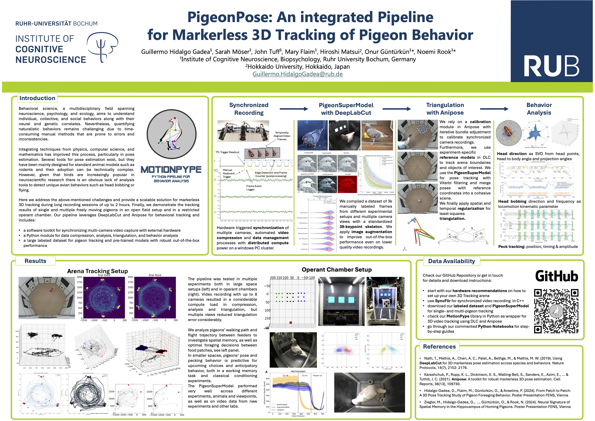

# MotionPype
A Python toolbox for behavior analysis with 3D markerless pose tracking

Coming soon!

Get in touch with [Guillermo.hidalgogadea@rub.de](Guillermo.hidalgogadea@rub.de) for early access. 

We use [syncFLIR](https://gitlab.ruhr-uni-bochum.de/ikn/syncflir.git), [DeepLabCut](https://github.com/DeepLabCut/DeepLabCut.git) and [Anipose](https://github.com/lambdaloop/anipose.git) to record, track and triangulate animal behavior. 

